# ⭐ Stellar Campus Rewards

<div align="center">

**Decentralized Student Achievement Protocol on the Stellar Network**

[](https://stellar.org)
[](https://soroban.stellar.org)
[](https://vitejs.dev)
[](LICENSE)

🔗 **Live Demo:** [stellar-campus-rewards.vercel.app](https://github.com/zeydaneng/stellar-campus-rewards)  
🔗 **GitHub:** [github.com/zeydaneng/stellar-campus-rewards](https://github.com/zeydaneng/stellar-campus-rewards)  
🔗 **Transaction Proof:** [stellar.expert/explorer/testnet/tx/fb5671...](https://stellar.expert/explorer/testnet/tx/fb5671a89769b552926525622dffed7b90eb3d0698296abd9769946f04b54191)

</div>

---

## 🌍 What Problem Does This Solve?

Traditional university reward systems are:

- **Opaque** — no one knows how decisions are made
- **Slow** — payments take days or weeks
- **Biased** — human approval is inconsistent
- **Siloed** — your achievements don't travel with you

**Stellar Campus Rewards** replaces this with a transparent, instant, and portable blockchain-based reputation system. Every task, every reward, every achievement is permanently recorded on the Stellar network — immutable proof of your contributions.

---

## ✨ What Makes This Unique

### 1. 🏛 University DAO Governance

Students and faculty hold voting power proportional to their **reputation score**. Reward policies, task categories, and XLM distribution rules are governed collectively — not dictated top-down. Every governance vote is recorded on-chain.

### 2. 📊 Decentralized Reputation Graph

Your reputation is a **composite on-chain score** built from 6 dimensions: Academic Tasks, Volunteering, Open Source, Attendance, Peer Reviews, and Innovation. This score is your **portable identity** — transferable across universities, employers, and DAOs.

### 3. 🎖 Proof-of-Contribution NFT Certificates

Every achievement unlocks an **NFT certificate** minted on Stellar. Unlike traditional certificates that live in a PDF on your laptop, these are cryptographically verified, publicly auditable, and impossible to fake. "I completed 10 blockchain tasks" backed by on-chain proof.

---

## 🚀 Feature Overview

| Feature                          | Status              | Innovation                      |
| -------------------------------- | ------------------- | ------------------------------- |
| Freighter Wallet Connect         | ✅ Live             |                                 |
| Student Task Submission          | ✅ Live             |                                 |
| Teacher Approval System          | ✅ Live             |                                 |
| XLM Reward Distribution          | ✅ Live             | Real Stellar transactions       |
| Live Transaction History         | ✅ Live             | Links to Stellar Expert         |
| **Reputation Score System**      | ✅ Live (Simulated) | Dynamic 6-dimension scoring     |
| **NFT Achievement Certificates** | ✅ Live (Simulated) | Proof-of-contribution UI        |
| **Campus Leaderboard**           | ✅ Live             | Real-time XP rankings           |
| **University DAO Voting**        | ✅ Live (Simulated) | Reputation-weighted governance  |
| **Multi-Role System**            | ✅ Live             | Student / Teacher / Admin views |
| **Real-time Notifications**      | ✅ Live             | Action-based feed               |
| Live Wallet Balance              | ✅ Live             | Stellar RPC polling             |

> **Hackathon Note on Simulated Features**: For this prototype, **XLM payments, Wallet connections, and Transaction tracking are 100% real and run on the Stellar Testnet**. Advanced features like Soroban NFT minting, DAO Governance contracts, and on-chain Reputation storage are fully simulated on the frontend React state. This demonstrates the exact UX of the intended Web3 product without requiring complex multi-contract deployments during the hackathon.

---

## ⚙️ Core Architecture

```
┌─────────────────────────────────────────────┐
│           Stellar Campus Rewards             │
├─────────────┬───────────────┬───────────────┤
│   Student   │    Teacher    │     Admin     │
│   Portal    │   Dashboard   │    Console    │
└─────────────┴───────────────┴───────────────┘
         │              │              │
         ▼              ▼              ▼
┌─────────────────────────────────────────────┐
│            React + Vite Frontend             │
│  Reputation Graph · Leaderboard · NFT Grid  │
└─────────────────────────┬───────────────────┘
                          │
                          ▼
┌─────────────────────────────────────────────┐
│           Freighter Wallet Layer             │
│     Transaction signing · Account info      │
└─────────────────────────┬───────────────────┘
                          │
                          ▼
┌─────────────────────────────────────────────┐
│         Stellar Soroban Testnet              │
│  Smart Contracts · XLM Payments · NFT Mint  │
│  DAO Governance · Reputation Storage        │
└─────────────────────────────────────────────┘
```

---

## 🛠 Tech Stack

| Layer           | Technology                        |
| --------------- | --------------------------------- |
| Frontend        | React + Vite                      |
| Blockchain      | Stellar (Soroban Testnet)         |
| Smart Contracts | Rust (Soroban SDK)                |
| Wallet          | Freighter                         |
| NFTs            | Stellar SEP-0011 / Custom Soroban |
| Reputation      | On-chain composite scoring        |
| Governance      | DAO voting contract               |

---

## 🚀 Quick Start

```bash
git clone https://github.com/zeydaneng/stellar-campus-rewards.git
cd stellar-campus-rewards/frontend
npm install
npm run dev
```

Open: `http://localhost:3000`

### Wallet Setup

1. Install [Freighter Wallet](https://freighter.app) browser extension
2. Switch to **Testnet** in Freighter settings
3. Fund your wallet at [laboratory.stellar.org](https://laboratory.stellar.org/#account-creator?network=test)
4. Connect in the app

---

## 🎮 Demo Flow (1-minute walkthrough)

```
1. Connect Freighter wallet          → See live XLM balance
2. View Dashboard                    → Stats, tasks, leaderboard preview
3. Submit a task                     → Task enters review queue
4. Switch to Teacher role            → See pending approvals panel
5. Approve task                      → XLM reward sent via Stellar tx
6. Check NFT Certificates            → Achievement auto-minted on-chain
7. View Leaderboard                  → Your XP rank vs campus peers
8. Open DAO Governance               → Vote on reward policy proposals
9. Click any transaction             → Opens Stellar Expert explorer
```

---

## 🏆 Innovation Highlights

### Why Stellar?

- **Near-zero fees** — 0.00001 XLM per transaction (~$0.000003)
- **Fast finality** — 3–5 second confirmation
- **Built for payments** — XLM is designed for value transfer
- **Soroban smart contracts** — modern WebAssembly-based contracts

### Reputation as Identity

Your **Reputation Score** is a composite metric computed from all on-chain activity. Unlike a GPA that lives in a university database you don't control, your campus reputation is:

- Publicly verifiable
- Portable across institutions
- Impossible to revoke or manipulate

### NFT Certificates vs. Paper Degrees

| Traditional Certificates      | Proof-of-Contribution NFTs                |
| ----------------------------- | ----------------------------------------- |
| Lives in a PDF on your laptop | Lives permanently on Stellar              |
| Can be faked                  | Cryptographically verified                |
| Siloed to one institution     | Visible to any employer/DAO               |
| Static                        | Dynamic — reflects real-time achievements |

---

## 🔮 Future Vision

### Phase 1 — MVP (Current)

- Task submission, approval, XLM rewards
- Reputation scoring, NFT certificates, leaderboard

### Phase 2 — Network Expansion

- **Multi-university federation** — one reputation, many campuses
- **Employer integration** — companies can query student reputation directly
- **Scholarship DAOs** — decentralized scholarship pools funded by alumni

### Phase 3 — Protocol

- **Open API** — any university can plug into the protocol
- **Cross-chain reputation** — bridge reputation to Ethereum, Solana ecosystems
- **Student DID** — decentralized identity document anchored on Stellar

---

## 📸 Screenshots

### 🏠 Home Page

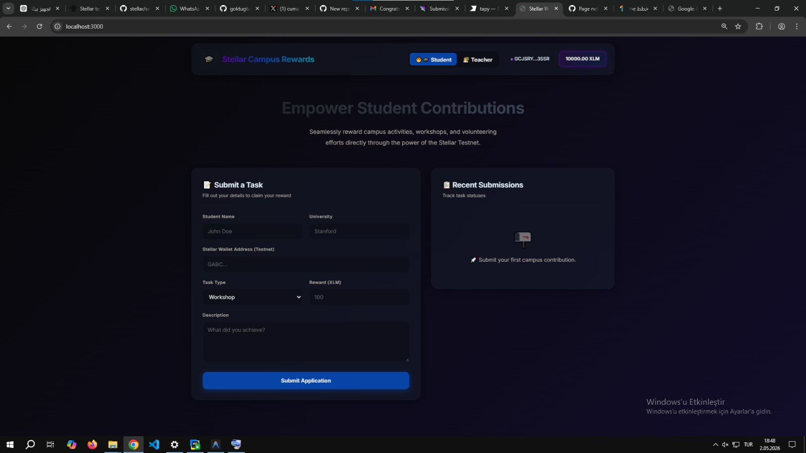

### 🧑‍🎓 Student View

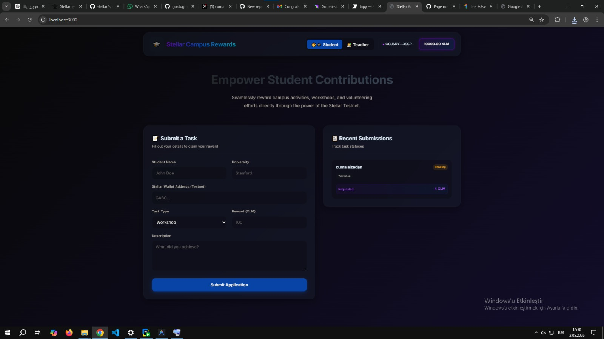

### 📝 Task Submission

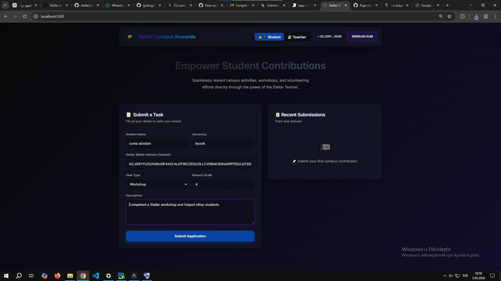

### ✅ Submission Success

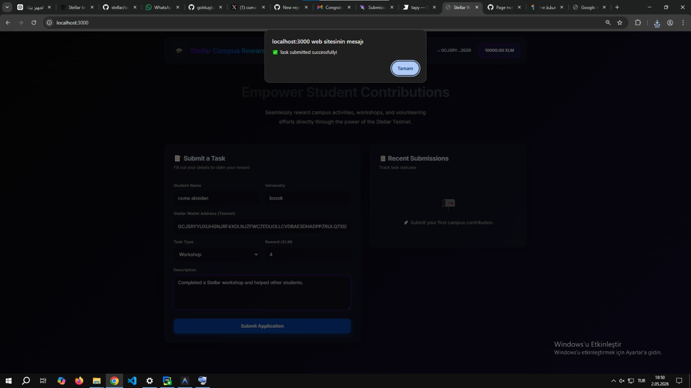

### 👨‍🏫 Teacher Dashboard

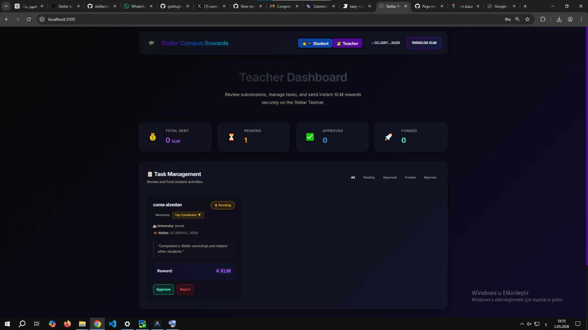

### 💸 Reward Sent

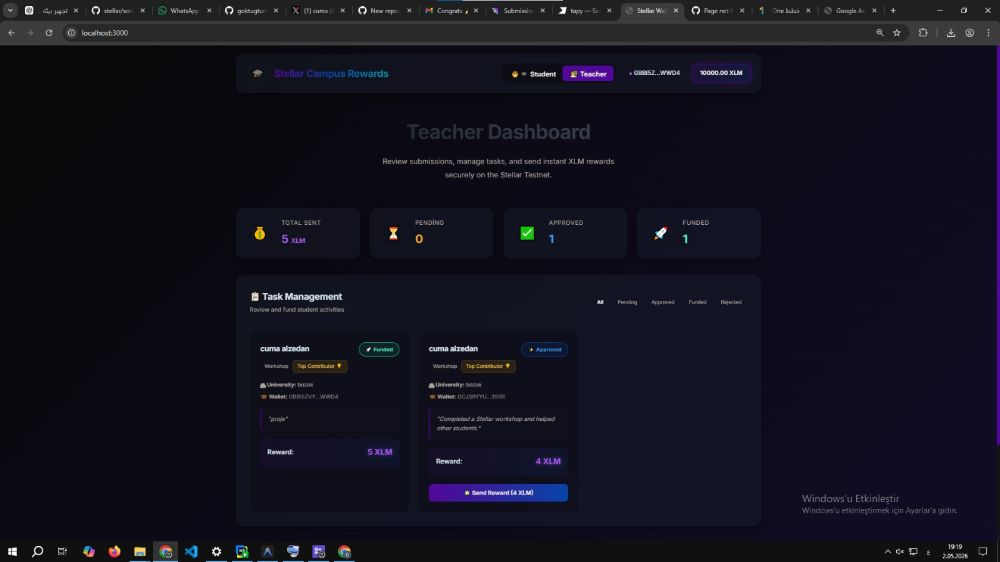

### ✅ Reward Sent Successfully

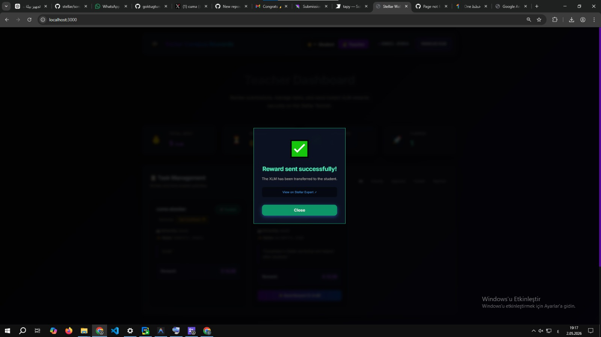

### 📜 Transaction History

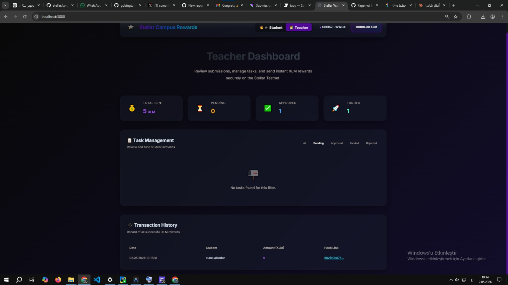

### 📊 Reputation System

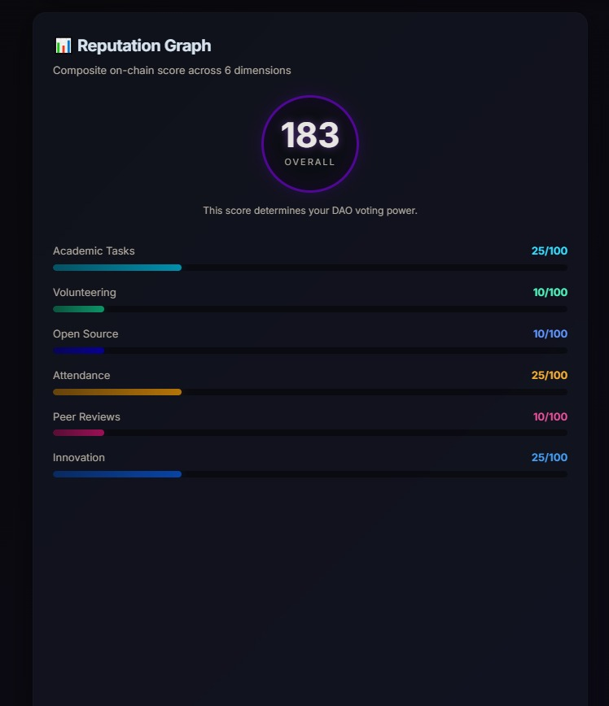

### 🏆 NFT Certificates

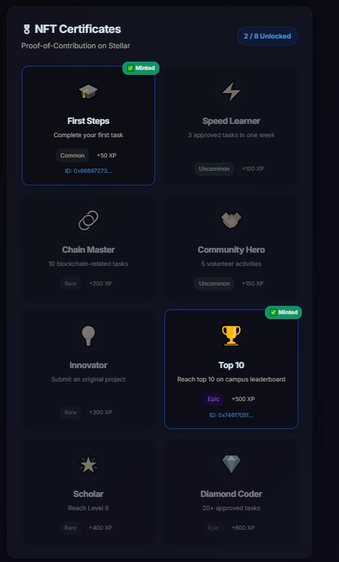

### 🏛 DAO Governance

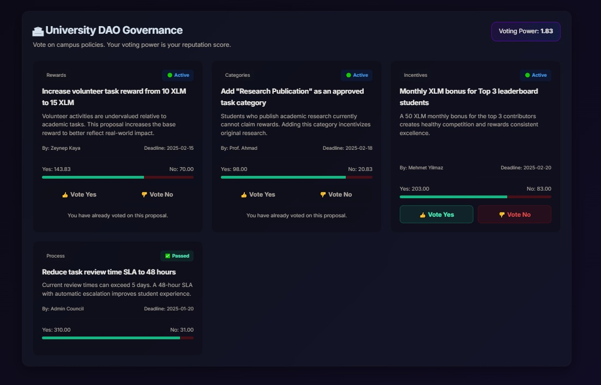

### 🥇 Leaderboard

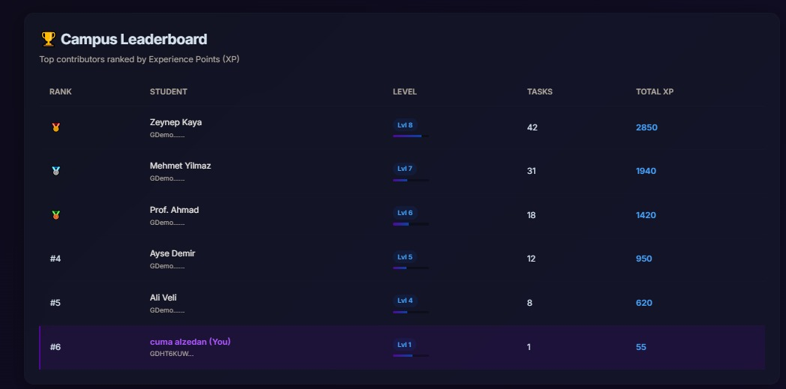

---

## 📬 Transaction Proof

Live Stellar Testnet transaction:  
[https://stellar.expert/explorer/testnet/tx/fb5671a89769b552926525622dffed7b90eb3d0698296abd9769946f04b54191](https://stellar.expert/explorer/testnet/tx/fb5671a89769b552926525622dffed7b90eb3d0698296abd9769946f04b54191)

---

## 👤 Builder

**Cuma Alzedan**  
Student at Bozok University · Blockchain Developer  
Building real-world decentralized applications on Stellar

_Submitted via Rise In platform_

---

<div align="center">

**Built with ❤️ on Stellar · Transparent · Instant · Trustless**

</div>
